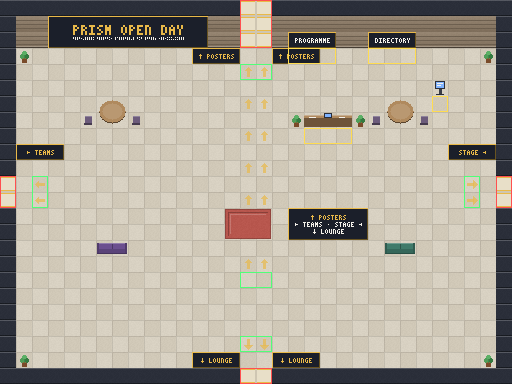

# PRISM Open Day · the WorkAdventure world

A walk-around venue for the PRISM open day, built on [WorkAdventure](https://workadventu.re).
PRISM is the Peer-vetted Research Initiative for Safety Methodologies, a sixteen-week
AI safety research fellowship run by [Women Who Do Data](https://w2d2.org).

**Play it:** https://play.workadventu.re/_/global/varchanaiyer.github.io/prism-openday-world/maps/lobby.tmj

Arrow keys or WASD to walk. Walk up to someone and your cameras connect. Stand on a sign
or a coloured strip and press SPACE. The buttons at the bottom jump between rooms.

## The building

```
        Technical      Evaluations      Frontier      Governance
        posters   <->  posters     <->  posters  <->  posters
            |              |               |             |
            +--------------+-- Poster foyer +-------------+
                                   |
      Team rooms  <---------- L O B B Y ----------->  Auditorium
                            (you start here)
                                   |
                                 Lounge  (with the quiet room)
```

| Map | What is there |
| --- | --- |
| `maps/lobby.tmj` | PRISM banner, welcome desk (about PRISM), programme and directory boards, a kiosk for prism-research.org, arrows and signs to every door |
| `maps/posters.tmj` | the poster foyer: four doors in the top wall, one per PRISM track, each with a coloured runner on the floor and a signpost in the middle |
| `maps/posters-technical.tmj`, `-evals`, `-frontier`, `-governance` | one room per track with the NeurIPS 2025 posters on standing boards; stand on the coloured strip below a board and press SPACE. Side doors join neighbouring tracks |
| `maps/stage.tmj` | the auditorium: screen, lectern with the programme, rows of seats, and one shared call for everyone inside |
| `maps/teams.tmj` | twelve pods, one per PRISM team, each with a nameplate, a project page and an opt-in team call |
| `maps/lounge.tmj` | coffee, sofas, the get-involved board, and a silent reading room with the reading list |

Pictures of every room, with doors and interaction spots outlined, are in [docs/previews/](docs/previews/).



## How it is made

Nothing here is drawn by hand. Three content files drive everything:

| File | What it holds |
| --- | --- |
| `content/posters.txt` | one line per poster: its PRISM track and its neurips.cc poster id |
| `content/posters.json` | what the fetch script found for each poster (title, authors, abstract, image address); regenerate, do not edit |
| `content/teams.json` | the twelve teams: mentor, title, one-line theme, track, and the paragraph on the team's page |

Scripts turn those into the world:

```
content/*  --fetch-posters-->  content/posters.json + content/thumbs/*.png
           --tileset-------->  tilesets/prism.png + prism.json   (floors, walls, signs, poster boards, nameplates)
           --build-maps----->  maps/*.tmj + src/world.json        (the rooms; every door is checked)
           --build-pages---->  pages/**/*.html                    (what opens in the side panel)
           --buildmap------->  dist/                              (validated, optimised, what gets deployed)
```

## Quick start on a fresh clone

```sh
git clone https://github.com/varchanaiyer/prism-openday-world
cd prism-openday-world
nvm use 22            # Node 20 or newer; the build tools need it
npm install
npm run posters       # fetches poster metadata and thumbnails from neurips.cc (thumbnails are not committed)
npm run content       # tileset, maps, pages
npm run previews      # a PNG of every room in docs/previews/
npm run buildmap      # validates every map exactly as the deploy does
```

`npm run dev` serves the maps locally. WorkAdventure's client runs on an https page and will
not load maps from `localhost`, so use an https tunnel: see [docs/HOW-TO-WORKADVENTURE.md](docs/HOW-TO-WORKADVENTURE.md).

## Changing things

| Want to | Do this |
| --- | --- |
| Hang a different poster, or move one to another track | edit `content/posters.txt`, then `npm run posters && npm run content` |
| Change a team's name, title, track or blurb | edit `content/teams.json`, then `npm run content` |
| Change the programme, about, directory or reading-list text | edit `scripts/build-pages.cjs`, then `npm run content` |
| Move a door, resize a room, add furniture, add a whole room | edit the room's function in `scripts/build-maps.cjs`: see [docs/editing-the-world.md](docs/editing-the-world.md) |
| Change what a sign says | edit `scripts/tileset.cjs`, then `npm run content` |
| Change the room buttons or the banners that appear as you walk in | `src/main.ts` and the `zones` block at the end of `scripts/build-maps.cjs` |
| Draw a room by hand in Tiled | open `maps/<room>.tmj` in Tiled, add a map property `handEdited = true`, save. The generator then leaves that file alone |

After any change: `npm run content`, look at `npm run previews`, run `npm run buildmap`, commit, push.

## Deploy

Push to `main`. GitHub Actions (`.github/workflows/build-and-deploy.yml`) runs `npm run build`
and publishes `dist/` to the `gh-pages` branch. The live world updates within about two minutes.
Generated files (`maps/`, `tilesets/`, `pages/`, `src/world.json`) are committed on purpose, so
the deploy needs no network access to neurips.cc.

Forks do not deploy to the live address. Work on a branch or a fork and open a pull request;
a preview image from `npm run previews` in the pull request says more than the diff.

To give someone push access, the owner runs
`gh api -X PUT repos/varchanaiyer/prism-openday-world/collaborators/<github-user> -f permission=push`
or uses Settings, Collaborators on GitHub.

## Hosting

The play address above uses WorkAdventure's free hosted plan: ten visitors at a time, unlimited
audio and video. For a bigger crowd, point a self-hosted WorkAdventure server at the same maps.
The Hetzner recipe (one small server, about 8 EUR a month) lives in the museum world repo,
`ai-safety-museum-world/hosting/`, and the play address pattern is
`https://<your host>/_/global/varchanaiyer.github.io/prism-openday-world/maps/lobby.tmj`.

## Folders

| Folder | What lives there |
| --- | --- |
| `content/` | the content files above; `thumbs/` is fetched and ignored by git |
| `scripts/` | `fetch-posters.cjs`, `world.cjs` (tracks, rooms, colours), `paint.cjs` (a tiny pixel painter and font), `tileset.cjs`, `build-maps.cjs`, `build-pages.cjs`, `preview.cjs`, `previews.cjs`, `postbuild.cjs` |
| `maps/`, `tilesets/`, `pages/`, `src/world.json` | generated, committed |
| `src/main.ts` | the map script: banners as you enter a zone, and the room buttons |
| `docs/` | the editing guide, the general WorkAdventure how-to, and previews of every room |
| `.github/workflows/` | the deploy |

## Licences

Code MIT (`LICENSE.code`). Maps CC BY 4.0. The generated tileset is CC0, except the poster
thumbnails painted into it, which belong to their authors and are shown with a link back to
neurips.cc. Poster pages embed the poster image served by neurips.cc; nothing is re-hosted.
